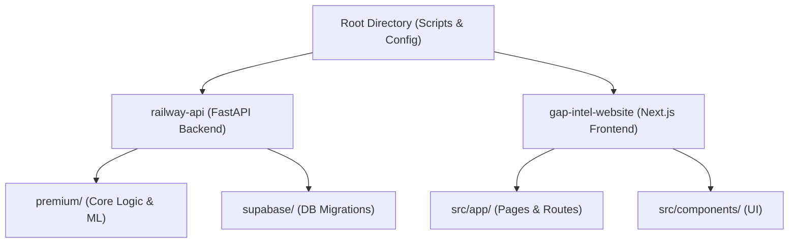

# GAP Intel: Codebase Overview

This document provides a high-level map of the GAP Intel project, explaining the purpose of each major directory and key script.

## Project Structure

## 1. Root Directory: Orchestration & Utilities
The root directory contains several standalone scripts used for local testing, analysis, and outreach.

- `GAP_ULTIMATE.py`: The primary production-grade analysis orchestrator. Handles the full 4-phase pipeline (Signal Filter, Pain Point Extraction, Gap Verification, Title Generation).
- `gap_analyzer.py`: A secondary/legacy analysis script. Still contains useful logic for Google Trends and competitor analysis.
- `dashboard.py`: A Streamlit-based local dashboard used to visualize `analysis_result.json` files.
- `outreach.py`: Automation script for YouTuber outreach. Finds business emails (via YouTube API or web search) and generates AI pitches.
- `ingest_manager.py`: Core utility for processing individual videos, fetching transcripts, and handling metadata.
- `scoring_engine.py`: Logic for various scoring metrics used throughout the pipeline.

## 2. Backend: `railway-api/`
The backend is a FastAPI application designed to run on Railway.

- `server.py`: The main FastAPI entry point. Defines routes for triggering analyses, checking status, and managing reports.
- `GAP_ULTIMATE.py`: Orchestrates the deep analysis pipeline.
- `ingest_manager.py`: Duplicate/Link of the root ingest manager for backend use.
- **`premium/`**: The "Heart" of the system. Contains the implementation of the 7 analytical skills:
    - `enhanced_gap_analyzer.py`: Multi-signal gap discovery.
    - `ml_models/`: Contains `CTRPredictor`, `ViralPredictor`, `ViewsVelocityPredictor`, and `SentimentEngine`.
    - `satisfaction_analyzer.py`: Analyzes viewer satisfaction signals.
    - `growth_pattern_analyzer.py`: Identifies content patterns that drive growth.
    - `market_intelligence.py`: Integration with Google Trends and niche patterns.
    - `thumbnail_optimizer.py` & `visual_analyzer.py`: Visual analysis and optimization tips.
- **`supabase/`**: Contains database migrations and SQL setup for embeddings and core tables.

## 3. Frontend: `gap-intel-website/`
A modern Next.js 14 (App Router) frontend.

- **`src/app/`**:
    - `page.tsx`: The main landing page / hero section.
    - `dashboard/`: User dashboard for managing analyses.
    - `report/[id]/`: The primary report viewing interface, showing the deep analysis results.
    - `viral-predictor/`: Dedicated tool for testing video titles and hooks.
- **`src/components/`**: Reusable UI components (Charts, Opportunity Cards, Navigation, etc.).
- **`src/lib/`**: Utility functions, Supabase client, and API interaction logic.

## 4. Agent Configuration: `.agent/`
Contains the knowledge, skills, and workflows that guide the AI agent.

- `knowledge/`: Detailed markdown guides (like this one) about the project.
- `skills/`: Specialized instruction sets for different analytical domains (e.g., `engagement-analysis`, `demand-signals`).
- `workflows/`: Step-by-step guides for common developer tasks (e.g., `deploy-railway`, `manage-database`).
