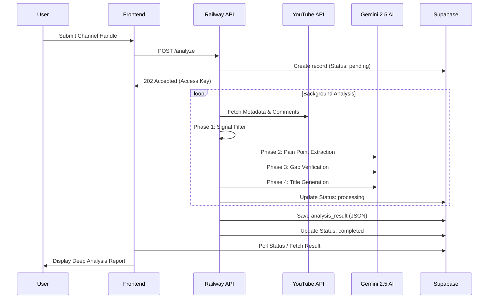

# GAP Intel: Data Flow

This document traces the path of data from a user's initial request to the final report delivery.

## High-Level Flow

## Step-by-Step Breakdown

### 1. Request Initiation
The user interacts with the Next.js landing page or dashboard, providing a YouTube channel handle (e.g., `@ChannelName`).

### 2. Analysis Trigger
The frontend calls the Railway-hosted FastAPI server. A unique `access_key` is generated, and a record is created in the `analyses` table in Supabase with a `pending` status.

### 3. Data Collection
The `DataCollector` and `YouTubeDataPipeline` modules fetch:
- Channel statistics (subs, views).
- Recent video metadata (titles, durations, publish dates).
- Top-level comments and transcripts for the last 15-20 videos.

### 4. The 4-Phase Pipeline
This core logic runs in `GAP_ULTIMATE.py`:
- **Signal Filtering**: Python logic prunes thousands of comments down to ~100 high-signal inquiries.
- **Pain Point Mapping**: AI identifies "what users are confused about".
- **Verification**: AI cross-references those needs against what the creator already said in their videos.
- **Ideation**: AI turns verified gaps into viral title ideas.

### 5. Enrichment
The analysis is enriched with:
- **Trends**: Real-time Google Trends trajectory data.
- **Competition**: Head-to-head metrics against top competitors in the niche.
- **Visuals**: Thumbnail analysis and optimization recommendations.

### 6. Storage & Delivery
The final complex JSON object is written to the `analysis_result` column in Supabase. The status is marked as `completed`. The frontend, which has been polling the status, detects the completion and renders the full report UI.
